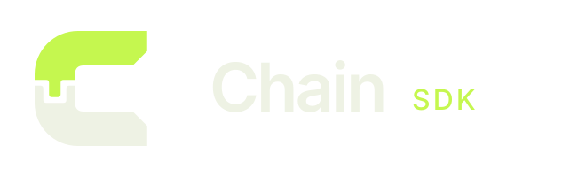

<p align="center">
  
</p>

# Chain

Chain is a cross-platform desktop framework. Your app is a React + TypeScript
frontend that calls one stable API, `@chain/sdk`. Behind that API, a Rust
layer (Chain Core) coordinates native work, enforces permissions and
normalizes errors, on top of a runtime that can be swapped out (Tauri today).

```ts
import { desktop } from "@chain/sdk";

const info = await desktop.platform.getInfo();
const rows = await desktop.storage.query("SELECT * FROM notes");
const text = await desktop.vision.recognizeText(imageBytes);
```

Apps never import Tauri, native adapters or OS APIs directly. Everything goes
through the SDK, so the runtime and native code underneath can change without
breaking the app.

```
Application
   ↓
Chain SDK          packages/sdk    public TypeScript API
   ↓
Chain Core (Rust)  crates/core     coordination, IPC, permissions, error normalization
   ↓
Chain Runtime                      Tauri today, swappable
   ↓
Native adapter / OS                Swift on macOS, C#/.NET on Windows
```

## Status

Chain is early. Every capability works on **macOS** (experimental), and none
has been verified on Windows or Linux yet. Contracts are still drafts. See
[`docs/CAPABILITY_MATRIX.md`](docs/CAPABILITY_MATRIX.md) for the
per-platform status.

## Capabilities

| Capability              | What it does                                                                     |
| ----------------------- | -------------------------------------------------------------------------------- |
| `desktop.platform`      | OS, version and architecture info                                                |
| `desktop.storage`       | SQLite: migrations, typed `table()` builder, transactions                        |
| `desktop.files`         | Managed local file storage: write, read, url, delete                             |
| `desktop.http`          | Native-side HTTP requests, axios-style                                           |
| `desktop.agentServer`   | A local `127.0.0.1`-only HTTP listener so external AI agents can call the app    |
| `desktop.processRunner` | Spawn an executable and stream its stdout/stderr                                 |
| `desktop.vision`        | On-device text recognition (OCR)                                                 |
| `desktop.speech`        | On-device transcription of a recording                                           |
| `desktop.models`        | User-downloaded, SHA-256-verified model packs                                    |
| `desktop.tts`           | Text to speech with Kokoro/Piper voices                                          |
| `desktop.audioRecorder` | Record the microphone, system audio, or both                                     |
| `desktop.browser`       | A separate signed-in browser window with its own session                         |
| `desktop.embeddings`    | On-device sentence embeddings                                                    |
| `desktop.window`        | Title bar, window buttons, appearance, drag regions, full screen                 |
| `desktop.pdf`           | Render an HTML document into a paginated PDF                                     |
| `desktop.share`         | The system share menu (AirDrop, Messages, Mail…)                                 |

Each capability has a README under
[`agent-docs/capabilities/<name>/`](agent-docs/README.md) covering how it
works, how to use it and which files to check.

## Getting started

Requirements: Node.js 22.18 or later, and a Rust toolchain (`chain doctor`
checks for it and offers to install it). Rust is only needed to build an app,
never by the people who run it.

The packages aren't on npm yet, so link the CLI from a clone of this repo:

```bash
git clone <this-repo> chain-sdk
cd chain-sdk/packages/cli && npm link
```

Then, from anywhere:

```bash
chain init my-app    # scaffold ./my-app: Tauri + React + TypeScript + Tailwind, wired to @chain/sdk
cd my-app
chain doctor         # check the Rust toolchain
npm run dev          # runs `chain dev`
```

The scaffolded app links `@chain/sdk` back to your clone's `packages/sdk`, so
run `npm link` again if you move or re-clone this repo.

## CLI

| Command                     | What it does                                                         |
| --------------------------- | -------------------------------------------------------------------- |
| `chain init <name>`         | Scaffold a new app in `./<name>`                                     |
| `chain dev`                 | Run the app in development                                           |
| `chain build`               | Build a release                                                      |
| `chain inspect`             | REPL to evaluate, click and read the live window during `chain dev`  |
| `chain update`              | Merge template changes into an existing app, keeping your edits      |
| `chain migration add <name>`| Generate the next migration from the app's `@Table` schema classes   |
| `chain database update`     | Apply pending migrations, or revert to a target                      |
| `chain clean`               | Free build-cache disk space (`--all` clears the shared cache)        |
| `chain doctor`              | Check and optionally install the Rust toolchain                      |

Full reference: [`agent-docs/framework/command/README.md`](agent-docs/framework/command/README.md).

## Repository layout

```
capabilities/<name>/   contract.ts (the API shape), component.json, contract tests
packages/sdk/          @chain/sdk — the public TypeScript API
packages/cli/          the `chain` CLI and app templates
crates/core/           Chain Core (Rust), plus Swift bridges in crates/core/swift
apps/playground/       a minimal app for exercising the SDK end to end
agent-docs/            per-feature docs: how it works, contracts, platform research
docs/                  architecture, capability matrix, workflow, design notes
site/                  the public documentation site (Next.js)
```

## Documentation

- [`docs/ARCHITECTURE.md`](docs/ARCHITECTURE.md) — layers and responsibility boundaries
- [`docs/MNEME_DESKTOP_FRAMEWORK.md`](docs/MNEME_DESKTOP_FRAMEWORK.md) — the reasoning behind the design
- [`docs/CAPABILITY_WORKFLOW.md`](docs/CAPABILITY_WORKFLOW.md) — how a new capability goes from request to shipped
- [`agent-docs/README.md`](agent-docs/README.md) — index of every feature doc

Run the documentation site locally:

```bash
npm run docs          # dev server at http://localhost:3000
npm run docs:build    # static site in site/out/
```

## Contributing

Read [`AGENTS.md`](AGENTS.md) first. It lists the rules that hold for every
change, whoever makes it. The short version:

- **Contract first.** A capability gets `CONTRACT.md` and `contract.ts` before
  any implementation.
- **No platform names in the public API.** Name things by what they mean to an
  app developer, not what they're called natively.
- **Detect capabilities, not platforms.** Apps check whether a capability is
  available, never `os === "windows"`.
- **Normalized errors.** Native errors become a shared `ChainErrorCode` at the
  Rust boundary.
- **Events over polling** wherever the OS can notify.
- **Driven by real needs.** Capabilities are added only when a real app needs
  them ([`docs/FRAMEWORK_CANDIDATES.md`](docs/FRAMEWORK_CANDIDATES.md)).
- **Docs ship with the change.** Every new or changed feature updates its
  README under `agent-docs/`.
